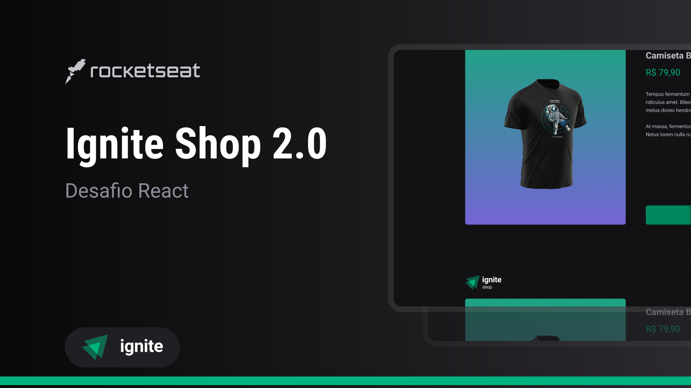

# Ignite Shop (E-commerce)

 

### Tecnologias utilizadas
 
 
 
### Sobre o projeto

Projeto desenvolvido com NextJs e TypeScript para desafio da trilha ignite da Rocketseat com integração com a Stripe, utilizando stitches para estilização, trata-se de um E-commerce, ao escolher a camisa desejada e clicar na opção de "Finalizar", será redirecionado para plataforma Stripe para finalizar a compra e em seguida, caso a compra seja confirmada, retornará para a página de sucesso.

### Home
 
 
 A home possui um carrossel com o valor, a imagem do produto, e a opção de adicionar a sacola.

 ### Detalhes do produto
  
   
 Ao clicar no produto, irá redirecionar para outra página onde será exibido os detalhes do produto com descrição e a opção de colocar na sacola.

### Conecte-se comigo

